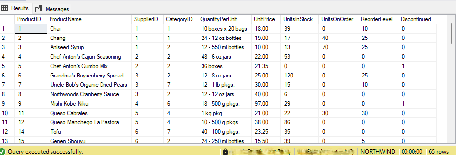
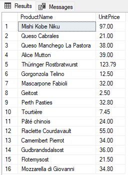

# Actividad 02

la base de datos northwind se puede crear usando el script ubicado en:

 https://github.com/microsoft/sql-server-samples/tree/master/samples/databases/northwind-pubs

Usar para la base de datos NorthWind para:

1.	Realizar un procedimiento almacenado que devuelva los clientes (Customers) según el país (Country).

[Código](./scripts/proc01.sql)

Prueba: `EXEC GetCustomersByCountry @Country = 'Germany';`

2.	Crear un procedimiento que determine la cantidad de clientes cuyo identificador (o sea el código) inicia con un determinado carácter.

[Código](./scripts/proc02.sql)

Prueba: `EXEC GetCustomerCountByInitial @Initial = 'A';`

3.	Realizar un procedimiento que determine la cantidad de registros que un cliente está en la tabla ORDERS.

[Código](./scripts/proc03.sql)

Prueba: `EXEC GetOrderCountByCustomer @CustomerID = 'ALFKI';`

4.	Realizar una base de datos similar a Northwind, pero que los nombre de tablas, campos y registros estén en castellano.

**Pendiente**

5.	Realizar un procedimiento que seleccione todos los registros de tabla Productos y Categories a la vez.

[Código](./scripts/proc05.sql)

Prueba: `EXEC GetAllProductsAndCategories;`

6.	Realizar un procedimiento que seleccione todos los productos que no corresponde a la categoría bebidas (1)

[Código](./scripts/proc06.sql)

Prueba: `EXEC GetProductsNotInBeverages;`

7.	Realizar un procedimiento que obtenga la cantidad de registros que no corresponde a condimentos

[Código](./scripts/proc07.sql)

Prueba: `EXEC GetCountOfNonCondimentProducts;`

8.	Realizar un procedimiento que seleccionar todos los campos de los registros que no corresponden a categoría mariscos de la tabla productos.

[Código](./scripts/proc08.sql)

Prueba: `EXEC GetProductsNotInSeafood;`

9.	Realizar un procedimiento que seleccionar los campos nombre del producto y precio (únicamente) de los  productos diferentes a cárnicos.

[Código](./scripts/proc09.sql)

Prueba: `EXEC GetNonMeatProductsNameAndPrice;`

10.	Realizar un procedimiento que obtenga la cantidad de productos granos y cereales.

[Código](./scripts/proc10.sql)

Prueba: `EXEC GetCountOfGrainsAndCerealsProducts;`

11.	Realizar un procedimiento que seleccionar los campos nombre del producto y precio (únicamente) de los quesos y productos cárnicos.

[Código](./scripts/proc11.sql)

Prueba: `EXEC GetCheeseAndMeatProductsNameAndPrice;`

12.	Realizar un procedimiento que seleccionar los campos nombre del producto, precio y stock (únicamente) de las frutas secas y mariscos.

[Código](./scripts/proc12.sql)

Prueba: `EXEC GetDriedFruitsAndSeafoodDetails;`

13.	Realizar un procedimiento que seleccionar el promedio de los precios de los confites.

[Código](./scripts/proc13.sql)

Prueba: `EXEC GetAveragePriceOfConfections;`

