# Actividad #01

## Problema

### a) Generar la siguiente base de datos

Con la siguiente información: [Datos](../BD/bd01.xlsx)

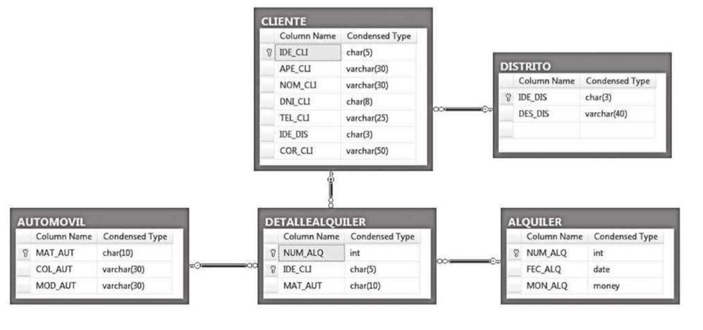

Para crear la base de datos, se utiliza el siguiente script: [Código](../BD/bd_creation.sql)

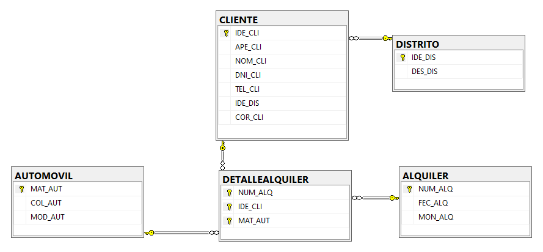

---

### b) Implementar las siguientes consultas

#### 1. Mostrar la información de un determinado cliente a través de variables y el uso de `PRINT`.
[Consulta 01](./scripts/query01.sql)

**Resultado de la consulta 1:**

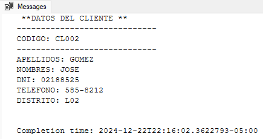

---

#### 2. Mostrar la información del detalle de alquiler a través de variables y el uso de `PRINT`.
[Consulta 02](./scripts/query02.sql)

**Resultado de la consulta 2:**

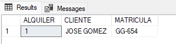

---

#### 3. Mostrar el nombre completo del cliente a partir de su código, a través de variables y el uso de `PRINT`.
[Consulta 03](./scripts/query03.sql)

**Resultado de la consulta 3:**

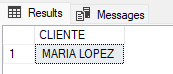  
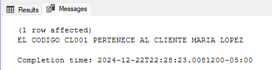

---

#### 4. Mostrar una lista de automóviles de un determinado color, dicho valor debe ser ingresado por una variable.
[Consulta 04](./scripts/query04.sql)

**Resultado de la consulta 4:**

---

#### 5. Script que permita registrar un nuevo automóvil; en caso de que ya exista, solo debe actualizarlo.
[Consulta 05](./scripts/query05.sql)

**Resultado de la consulta 5:**

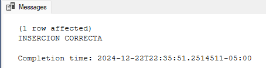  
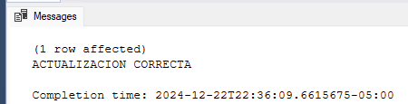

---

#### 6. Script que permita registrar un nuevo cliente validando la existencia del nombre del distrito. En caso de que el distrito exista, los datos del cliente se registrarán; caso contrario, mostrar el mensaje "Código de distrito no existe".
[Consulta 06](./scripts/query06.sql)

**Resultado de la consulta 6:**

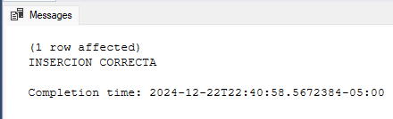  
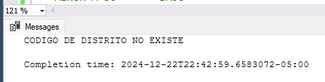

---

#### 7. Mostrar el siguiente listado de los alquileres, adicionando una columna que tome en cuenta el siguiente criterio:

| MONTO ALQUILER | CRITERIO |
|----------------|----------|
| MENOR A 50     | BAJO     |
| ENTRE 50 Y 100 | MEDIO    |
| MAYOR A 100    | ALTO     |

[Consulta 07](./scripts/query07.sql)

**Resultado de la consulta 7:**

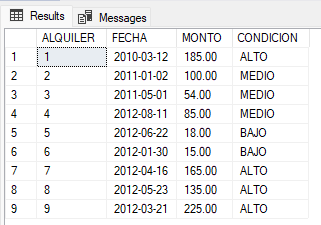
