# Actividad 02

La base de datos northwind se puede crear usando el script ubicado en:

 https://github.com/microsoft/sql-server-samples/tree/master/samples/databases/northwind-pubs

---
Usar la base de datos NorthWind para:

### 1.	Realizar un procedimiento almacenado que devuelva los clientes (Customers) según el país (Country).

[Procedimiento 01](./scripts/proc01.sql)

Prueba:

```EXEC GetCustomersByCountry @Country = 'Germany';```

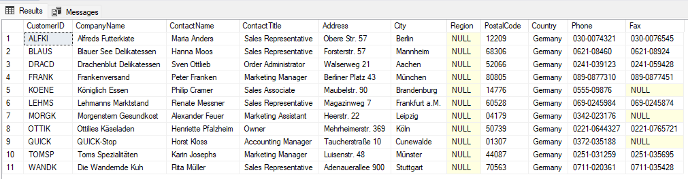

---

### 2.	Crear un procedimiento que determine la cantidad de clientes cuyo identificador (o sea el código) inicia con un determinado carácter.

[Procedimiento 02](./scripts/proc02.sql)

Prueba: 

```EXEC GetCustomerCountByInitial @Initial = 'A';```

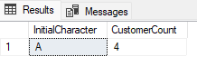

---
### 3.	Realizar un procedimiento que determine la cantidad de registros que un cliente está en la tabla ORDERS.

[Procedimiento 03](./scripts/proc03.sql)

Prueba:

```EXEC GetOrderCountByCustomer @CustomerID = 'ALFKI';```

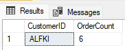

---
### 4.	Realizar una base de datos similar a Northwind, pero que los nombre de tablas, campos y registros estén en castellano.

**Pendiente**

---
### 5.	Realizar un procedimiento que seleccione todos los registros de tabla Productos y Categories a la vez.

[Procedimiento 05](./scripts/proc05.sql)

Prueba:

```EXEC GetAllProductsAndCategories;```

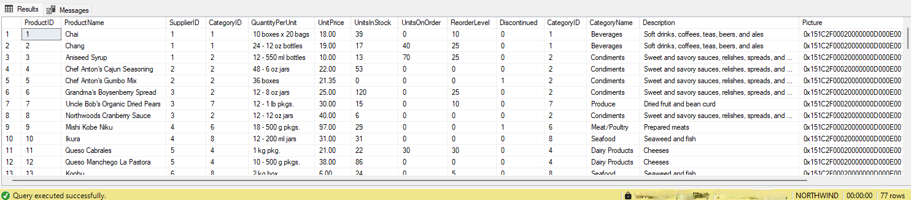

---
### 6.	Realizar un procedimiento que seleccione todos los productos que no corresponde a la categoría bebidas (1)

[Procedimiento 06](./scripts/proc06.sql)

Prueba:

```EXEC GetProductsNotInBeverages;```

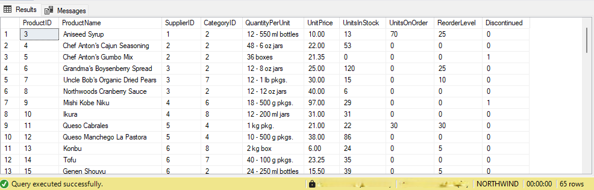

---
### 7.	Realizar un procedimiento que obtenga la cantidad de registros que no corresponde a condimentos

[Procedimiento 07](./scripts/proc07.sql)

Prueba:

```EXEC GetCountOfNonCondimentProducts;```

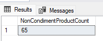

---
### 8.	Realizar un procedimiento que seleccionar todos los campos de los registros que no corresponden a categoría mariscos de la tabla productos.

[Procedimiento 08](./scripts/proc08.sql)

Prueba:

```EXEC GetProductsNotInSeafood;```

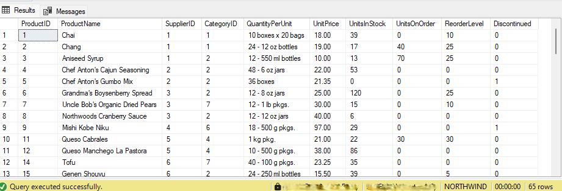

---
### 9.	Realizar un procedimiento que seleccionar los campos nombre del producto y precio (únicamente) de los  productos diferentes a cárnicos.

[Procedimiento 09](./scripts/proc09.sql)

Prueba:

```EXEC GetNonMeatProductsNameAndPrice;```

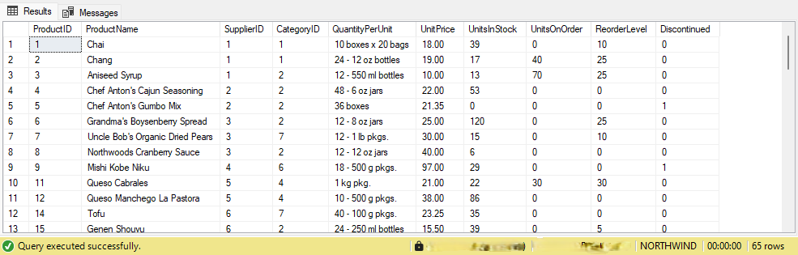

---
### 10.	Realizar un procedimiento que obtenga la cantidad de productos granos y cereales.

[Procedimiento 10](./scripts/proc10.sql)

Prueba:

```EXEC GetCountOfGrainsAndCerealsProducts;```

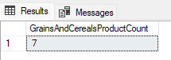

---
### 11.	Realizar un procedimiento que seleccionar los campos nombre del producto y precio (únicamente) de los quesos y productos cárnicos.

[Procedimiento 11](./scripts/proc11.sql)

Prueba:

```EXEC GetCheeseAndMeatProductsNameAndPrice;```

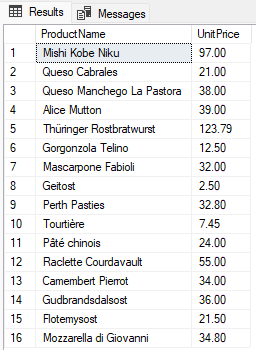

---
### 12.	Realizar un procedimiento que seleccionar los campos nombre del producto, precio y stock (únicamente) de las frutas secas y mariscos.

[Procedimiento 12](./scripts/proc12.sql)

Prueba:

```EXEC GetDriedFruitsAndSeafoodDetails;```

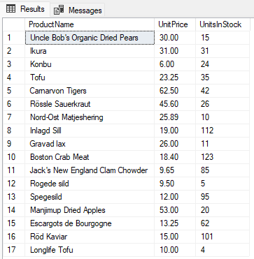

---
### 13.	Realizar un procedimiento que seleccionar el promedio de los precios de los confites.

[Procedimiento 13](./scripts/proc13.sql)

Prueba:

```EXEC GetAveragePriceOfConfections;```

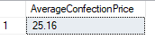
---