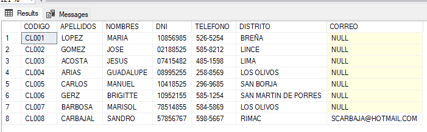
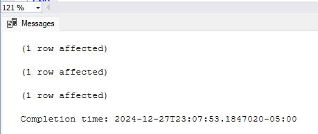
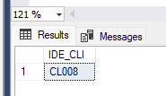
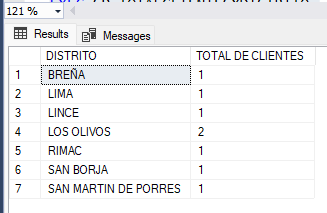
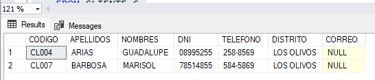
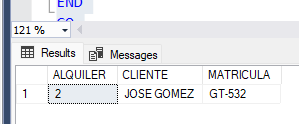
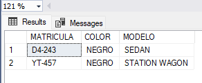
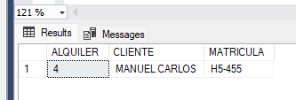
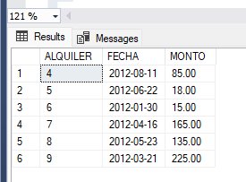

# Actividad 03

Implemente los siguientes procedimientos almacenados:

### 1. Procedimiento almacenado que permita listar los datos de los clientes, dentro de los cuales se debe mostrar el nombre del distrito.

[Procedimiento 01](./scripts/sp01.sql)

Resultado:

---

### 2. Procedimientos almacenados que permitan dar mantenimiento a la tabla CLIENTE.
[Procedimiento 02](./scripts/sp02.sql)

Resultado:

---

### 3. Procedimiento almacenado que determine el último código del cliente registrado.
[Procedimiento 03](./scripts/sp03.sql)

Resultado:

---

### 4. Procedimiento almacenado que muestre el total de clientes por distrito.
[Procedimiento 04](./scripts/sp04.sql)

Resultado:

---

### 5. Procedimiento almacenado que permita listar los clientes de un determinado distrito.
[Procedimiento 05](./scripts/sp05.sql)

Resultado:

---

### 6. Procedimiento almacenado que permita mostrar información del detalle de alquiler, de acuerdo al número de alquiler.
[Procedimiento 06](./scripts/sp06.sql)

Resultado:

---

### 7. Procedimiento almacenado que permita mostrar los registros de automóviles de un determinado color.
[Procedimiento 07](./scripts/sp07.sql)

Resultado:

---

### 8. Procedimiento almacenado que muestra el detalle de alquiler de acuerdo al nombre de un determinado cliente.
[Procedimiento 08](./scripts/sp08.sql)

Resultado:

---

### 9. Procedimiento almacenado que permita listar los alquileres de un determinado año de registro.
[Procedimiento 09](./scripts/sp09.sql)

Resultado:

