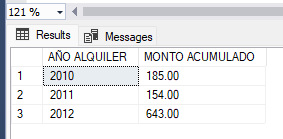

# Actividad #04: Funciones - SQL

## 1. Función que devuelva el promedio del monto de alquiler

Esta función devuelve el promedio del monto de alquiler, para luego mostrar el siguiente reporte:

| AÑO ALQUILER | PROMEDIO POR AÑO |
|--------------|------------------|
| 9999         | 999.99           |
| 9999         | 999.99           |
| 9999         | 999.99           |

[Código](./scripts/script01.sql)

---

## 2. Función que permita mostrar el menor monto de alquiler en un determinado año

Esta función devuelve el monto mínimo de alquiler en un determinado año, para luego mostrar el siguiente reporte:

| MONTO MINIMO | AÑO ALQUILER |
|--------------|--------------|
| 999.99       | 9999         |
| 999.99       | 9999         |
| 999.99       | 9999         |

[Código](./scripts/script02.sql)

---

## 3. Función que permita mostrar el monto acumulado de alquiler en un determinado año

Esta función devuelve el monto acumulado de alquiler en un determinado año, para luego mostrar el siguiente reporte:

| AÑO ALQUILER | MONTO ACUMULADO |
|--------------|-----------------|
| 9999         | 999.99          |
| 9999         | 999.99          |
| 9999         | 999.99          |

[Código](./scripts/script03.sql)

---

## 4. Función que permita mostrar el total de automóviles de un determinado color

Esta función devuelve el total de automóviles de un determinado color, para luego mostrar el siguiente reporte:

| COLOR DE AUTO | TOTAL |
|---------------|-------|
| XXXXXXXXX     | 99    |
| XXXXXXXXX     | 99    |

[Código](./scripts/script04.sql)

---

## 5. Función que permita mostrar la diferencia de años entre la fecha de alquiler y el año actual

Esta función muestra la diferencia de años entre la fecha de alquiler y el año actual, para luego mostrar el siguiente reporte:

| ALQUILER | MONTO  | FECHA ALQUILER | DIFERENCIA EN AÑOS |
|----------|--------|-----------------|--------------------|
| 99       | 999.99 | 99/99/9999      | 99                 |
| 99       | 999.99 | 99/99/9999      | 99                 |
| 99       | 999.99 | 99/99/9999      | 99                 |

[Código](./scripts/script05.sql)

---

## 6. Función tabla en línea que permita mostrar todos los registros de los clientes

Esta función muestra todos los registros de los clientes. Luego, muestra a los clientes de un determinado distrito.

[Código](./scripts/script06.sql)

---

## 7. Función tabla en línea que permita mostrar todos los registros de los automóviles de un determinado color

Esta función muestra todos los registros de los automóviles de un determinado color, para luego mostrar una lista de los automóviles de un determinado color.

[Código](./scripts/script07.sql)

---

## 8. Función tabla en línea que permita mostrar todos los registros de los alquileres según el año de registro

Esta función muestra todos los registros de los alquileres según el año de registro. Luego, muestra el registro de los alquileres de un determinado año.

[Código](./scripts/script08.sql)

---

## 9. Función multisentencia que permita mostrar todos los registros de los automóviles

Esta función muestra todos los registros de los automóviles.

[Código](./scripts/script09.sql)

---

## 10. Función multisentencia que permita mostrar todos los registros de los detalles de alquileres

Esta función muestra todos los registros de los detalles de alquileres.

[Código](./scripts/script10.sql)

