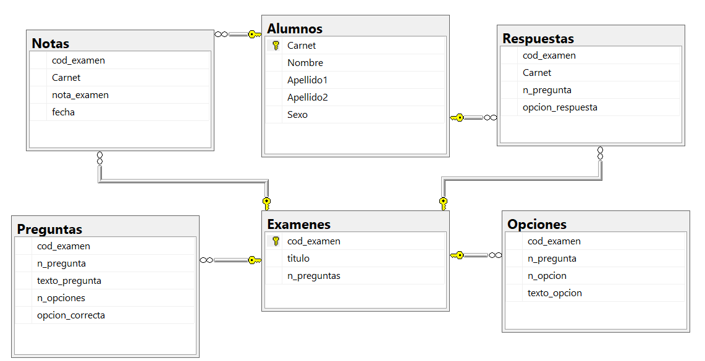
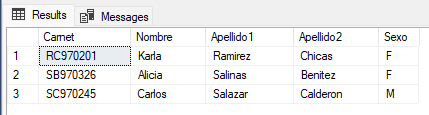
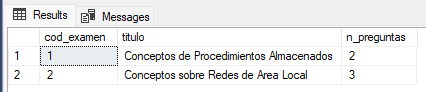
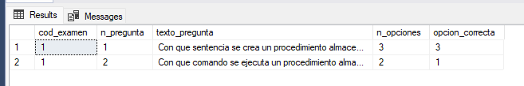
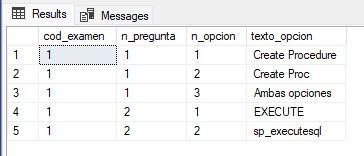
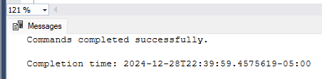
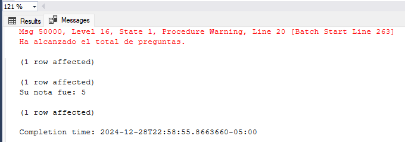
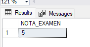
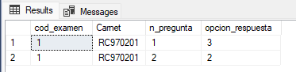
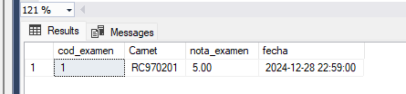

El desarrollo se ubica en el siguiente script: [Desarrollo](./scripts/ex01.sql)

### 1. Creando la base de datos



---
### 2. Insertar datos en la tabla `Alumnos` con un procedimiento llamado `Insert_Alumno`

```sql
EXEC Insert_Alumno 'SB970326', 'Alicia', 'Salinas', 'Benitez', 'F';
EXEC Insert_Alumno 'SC970245', 'Carlos', 'Salazar', 'Calderon', 'M';
EXEC Insert_Alumno 'RC970201', 'Karla', 'Ramirez', 'Chicas', 'F';
```


---
3. Insertar datos en las tablas `Examenes`, `Preguntas` y `Opciones`

```sql
-- Agregando Datos del Examen
EXEC Insert_Exa 1, 'Conceptos de Procedimientos Almacenados', 2;
EXEC Insert_Exa 2, 'Conceptos sobre Redes de Area Local', 3;
SELECT * FROM Examenes;
```


```sql
-- Agregando datos a preguntas
INSERT INTO Preguntas (cod_examen, n_pregunta, texto_pregunta, n_opciones, opcion_correcta)
VALUES 
(1, 1, 'Con que sentencia se crea un procedimiento almacenado:', 3, 3),
(1, 2, 'Con que comando se ejecuta un procedimiento almacenado:', 2, 1);
SELECT * FROM Preguntas;
```


```sql
-- Agregando datos a opciones
INSERT INTO Opciones (cod_examen, n_pregunta, n_opcion, texto_opcion)
VALUES 
(1, 1, 1, 'Create Procedure'),
(1, 1, 2, 'Create Proc'),
(1, 1, 3, 'Ambas opciones'),
(1, 2, 1, 'EXECUTE'),
(1, 2, 2, 'sp_executesql');
SELECT * FROM Opciones;
```



---
### 4. Mensaje de error definido por el usuario

```sql
-- Creando los mensajes o verificar si ya existe el mensaje
USE master;
GO

EXEC sp_addmessage 50001, 16, N'Usted se encuentra en la ultima pregunta del examen';
GO
```



### 5. Crear procedimiento almacenado `Calculo_de_Nota`

```sql
CREATE PROC Calculo_de_Nota
@carnetx VARCHAR(10),
@codexamen INT
AS
BEGIN
    DECLARE @totcorrecta INT,      -- contador para respuestas correctas
            @porcentaje FLOAT,     -- porcentaje de cada pregunta
            @npreguntas INT,       -- número de preguntas del examen
            @correctaresp INT,     -- captura la opción correcta del examen (opc_correcta)
            @respuesta INT,        -- captura la opción que seleccionó el alumno (opcion_respuesta)
            @perfect FLOAT,        -- constante = 10
            @NOTA FLOAT;           -- nota del examen

    -- Verifica la cantidad de preguntas que tiene el examen
    SELECT @npreguntas = CONVERT(FLOAT, COUNT(n_pregunta))
    FROM Preguntas
    WHERE cod_examen = @codexamen;

    -- Asigna un valor a la variable @perfect
    SELECT @perfect = 10.00;

    -- Calcula el porcentaje para cada pregunta
    SELECT @porcentaje = @perfect / @npreguntas;

    -- Inicializa el contador de respuestas correctas a 0
    SELECT @totcorrecta = 0;

    -- Bucle para verificar cada pregunta
    WHILE (@npreguntas > 0)
    BEGIN
        -- Asigna la opción correcta del examen
        SELECT @correctaresp = opcion_correcta
        FROM Preguntas
        WHERE (cod_examen = @codexamen AND n_pregunta = @npreguntas);

        -- Asigna la respuesta del alumno del examen
        SELECT @respuesta = opcion_respuesta
        FROM Respuestas
        WHERE (cod_examen = @codexamen AND Carnet = @carnetx AND n_pregunta = @npreguntas);

        -- Compara la opción correcta del examen con la respuesta del alumno
        IF (@correctaresp = @respuesta)
        BEGIN
            -- Incrementa el contador si coinciden las opciones
            SELECT @totcorrecta = @totcorrecta + 1;
        END

        -- Decrementa el total de preguntas
        SELECT @npreguntas = @npreguntas - 1;
    END

    -- Calcula la nota del examen
    SELECT @NOTA = @totcorrecta * @porcentaje;

    -- Agrega la nota a la tabla Notas
    INSERT INTO Notas (cod_examen, Carnet, nota_examen, fecha)
    VALUES (@codexamen, @carnetx, @NOTA, GETDATE());
	END;

    -- Mostrar la nota en la ventana de resultados
    SELECT 'NOTA_EXAMEN' = CONVERT(FLOAT, @NOTA);

GO
```

### 6. Crear `TRIGGER` que se activa despues de cada insercion

```sql
-- A la pregunta 1 contestó la opción 3, es la correcta
INSERT INTO Respuestas (cod_examen, Carnet, n_pregunta, opcion_respuesta)
VALUES (1, 'RC970201', 1, 3);

-- A la pregunta 2 contestó la opción 2, contestó mal
INSERT INTO Respuestas (cod_examen, Carnet, n_pregunta, opcion_respuesta)
VALUES (1, 'RC970201', 2, 2);
```






```sql
-- Verificando los registros de la tabla Respuestas
SELECT * FROM Respuestas;
```

```sql
-- Verificando los registros de la tabla Notas
SELECT * FROM Notas;
```
