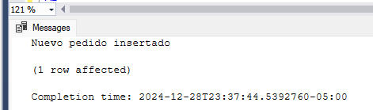
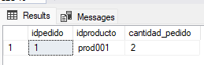
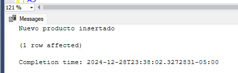
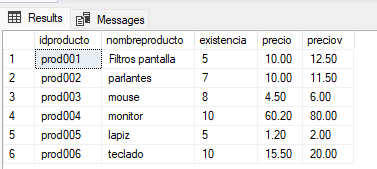
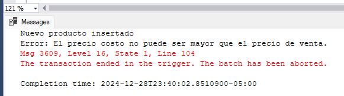
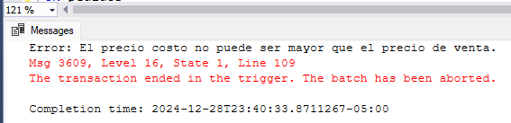
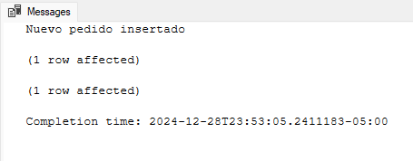
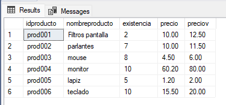
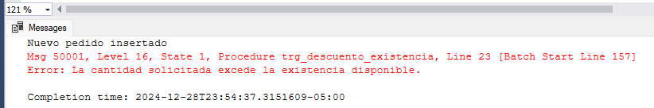

# Ejercicios

El desarrollo se ubica en:
[Desarrollo](./script/script06.sql)

### 1. Crear un desencadenador que se active cada vez que se inserte un registro en la tabla pedidos y otro para la tabla producto.

```sql
-- Insertar un nuevo pedido (esto activará el trigger trg_insert_pedido)
INSERT INTO pedidos (idproducto, cantidad_pedido)
VALUES ('prod001', 2);
```



```sql
-- Insertar un nuevo producto (esto activará el trigger trg_insert_producto)
INSERT INTO producto (idproducto, nombreproducto, existencia, precio, preciov)
VALUES ('prod006', 'teclado', 10, 15.5, 20.0);
```



---
### 2. Crear un desencadenador para la tabla producto, que se active cada vez que se inserte un registro o se actualice la columna precio, la condición para aceptar al inserción o la actualización es que el precio costo no debe ser mayor que el precio venta.

```sql
-- Intentar insertar un producto con precio costo mayor que el precio de venta
-- Esto debería disparar un error y hacer rollback de la transacción.
INSERT INTO producto (idproducto, nombreproducto, existencia, precio, preciov)
VALUES ('prod007', 'auriculares', 10, 30.0, 25.0);
```


```sql
-- Intentar actualizar el precio de un producto para que el precio costo sea mayor que el precio de venta
-- Esto debería disparar un error y hacer rollback de la transacción.
UPDATE producto
SET precio = 50.0, preciov = 40.0
WHERE idproducto = 'prod001';
```


---
### 3. Crear un desencadenador para la tabla pedidos que cada vez que se realice un pedido descuente la existencia de la tabla productos, en caso que la cantidad del pedido supere a la existencia debe deshacer la transacción y mostrar un mensaje de error.

```sql
-- Insertar un pedido que no exceda la existencia del producto (esto debería descontar la existencia).
INSERT INTO pedidos (idproducto, cantidad_pedido)
VALUES ('prod001', 3);
```



```sql
-- Intentar insertar un pedido con una cantidad mayor que la existencia disponible (esto debería hacer rollback).
INSERT INTO pedidos (idproducto, cantidad_pedido)
VALUES ('prod001', 10);
```

